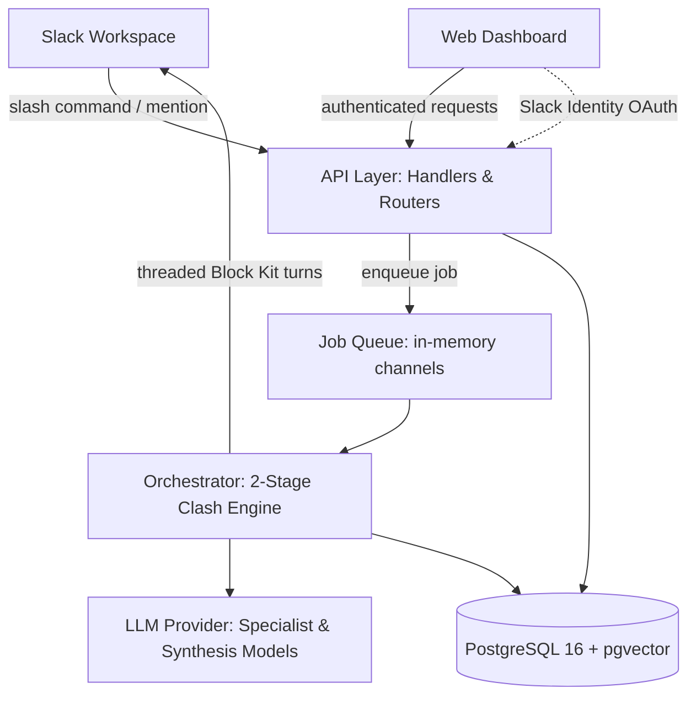

# AI War Room: criAIsis
## Business Requirements Document & Product Architecture

---

# PART A — Business Requirements Document (BRD)

## A.1 Executive Summary

AI War Room (**criAIsis**) is a Slack-native incident investigation platform that spins up a simulated team of specialist AI agents — Network, Database, Application, and Security — to debate an active incident in real time, in-thread, grounded in each team's own runbooks and documentation. 

**Core Product Mandate:**
> **The Agent's Role is Deep Read-Only Diagnostic Investigation, NEVER Blind Autonomous Production Remediation.**

The agents act as expert investigative detectives. They do not mutate production or execute destructive operations. Instead, via grounded RAG and optional read-only diagnostic APIs (or Model Context Protocol / MCP), they rapidly answer:
1. **Which specific logs and error stack traces are failing?**
2. **Which department/domain owns the problem?** (Network, Database, Application, Security)
3. **What is the root cause classification?** Is it an **Infrastructure issue**, a **Code-level regression**, or **Both (Hybrid)**?

## A.2 Problem Statement

When an outage strikes, the on-call Incident Commander (IC) must quickly form a hypothesis across technical domains they may not be expert in (network routing, database connection saturation, microservice panics, security anomalies), usually while the human specialists who *are* expert in those domains are asleep or paged into a chaotic call. 

Existing incident AI tools compress alerts into a single flattened, hallucinated summary, obscuring cross-domain tensions and failure distinctions (e.g. mistaking an unindexed code migration for a database capacity issue).

## A.3 Business Objectives

| Objective | Description |
|---|---|
| **Reduce Mean Time to Hypothesis (MTTH)** | Deliver a grounded, cross-domain diagnostic hypothesis within 25 seconds of incident trigger |
| **Categorize Root-Cause Nature** | Accurately classify failures into Code-Level, Infrastructure-Level, or Hybrid root causes |
| **Preserve Institutional Knowledge** | Every debate cites verified runbook excerpts, and transcripts form permanent post-mortem audit logs |
| **Zero Production Blast Radius** | Strict read-only diagnostic posture guarantees agents never trigger unintended production mutations |
| **Low Friction / In-Situ Workflow** | Operates entirely within Slack threads where incident firefighting already occurs |

## A.4 Target Users / Personas

| Persona | Role | Primary Need |
|---|---|---|
| **Incident Commander (IC)** | On-call engineer running an active war room | Rapid, trustworthy cross-domain hypothesis without paging everyone immediately |
| **Platform / SRE Admin** | Configures and maintains knowledge bases | Easy runbook ingestion, micro-batch status visibility, and prompt tuning |
| **Paged Specialist** | Joins mid-incident in Slack | Fast catch-up on what hypotheses were ruled in/out and cited runbook evidence |

## A.5 Scope

**In scope for MVP:**
- Multi-tenant data architecture from Day 1 (`workspace_id` scoping on every table and repository)
- Slack app installable via OAuth with AES-GCM-256 encrypted bot token storage
- Asynchronous micro-batch document ingestion with explicit status tracking (`pending`, `indexed`, `failed`)
- Four fixed personas (network, database, application, security) with editable system prompts and enable/disable toggles
- Slash-command-triggered 2-Stage Asynchronous Clash:
  - Stage 1: Concurrent parallel specialist hypotheses (<10s)
  - Stage 2: Cross-domain rebuttal & IC consensus synthesis with root-cause classification (<15s)
- Native 4-tier incident severity model (`sev-1` through `sev-4`)
- Hybrid citation tracking: relational `referenced_chunk_ids UUID[]` plus immutable `CitationSnapshot` in metadata JSONB
- In-thread `@mention` follow-ups returning runbook-grounded diagnostic guidance and copy-paste human commands
- Manual incident resolution (`/criaisis resolve`)
- Local Incident Simulation & Debugging Framework for dev-environment scenario reproduction
- Lean Web dashboard for persona tuning, runbook management, incident history, and transcript auditing

**Out of scope for MVP:**
- Autonomous production remediation (no write/mutation access to clusters)
- Distributed Redis clustering (in-memory Go channels satisfy MVP queue needs)
- Vanity analytics charts (MTTR dashboards deferred)
- Direct mutation integrations with cloud providers

## A.6 Functional Requirements

| ID | Requirement |
|---|---|
| FR-1 | Admin can install the Slack app into their workspace via OAuth |
| FR-2 | Admin can upload, view, and delete documents, each tagged to exactly one persona |
| FR-3 | Document ingestion executes asynchronously with status tracking (`pending`, `indexed`, `failed`) and chunk counts |
| FR-4 | Admin can edit each persona's display name, system prompt, and enabled/disabled state |
| FR-5 | Any workspace member can initiate a debate via `/criaisis investigate` specifying description and optional severity (`sev-1` to `sev-4`) |
| FR-6 | System executes 2-Stage Asynchronous Clash: Stage 1 concurrent specialist RAG; Stage 2 cross-rebuttal and consensus synthesis |
| FR-7 | Each specialist agent is strictly grounded only in documents tagged to its persona (zero cross-persona leakage) |
| FR-8 | Consensus synthesis explicitly classifies root cause into **Code-Level**, **Infrastructure**, or **Hybrid** |
| FR-9 | Turn citations store immutable snapshots (`CitationSnapshot`) in metadata JSONB ensuring post-mortems survive document modification |
| FR-10 | Any member can `@mention` a specialist in-thread (`@criaisis @database ...`) and receive targeted diagnostic guidance and copy-paste queries |
| FR-11 | Any member can mark an incident resolved via `/criaisis resolve`, locking the transcript and timestamping resolution |
| FR-12 | Developers can reproduce and debug incidents locally using the Local Incident Simulation Framework without production outages |
| FR-13 | Web dashboard displays incident transcripts, active war rooms, and cited runbook excerpts with Slack OAuth authentication |

## A.7 Non-Functional Requirements

| Category | Requirement |
|---|---|
| **Latency** | Slash command acknowledges in <500ms; full 2-stage debate posts in <25 seconds |
| **Tenant Isolation** | Schema-level and repository-level scoping prevents any cross-tenant data leakage |
| **Audit Durability** | Debate turns are append-only; citations preserve immutable snapshot text |
| **Graceful Degradation** | If one agent LLM call times out, the remaining 3 agents and consensus still post |
| **Security** | Bot tokens encrypted at rest via AES-GCM-256; zero plaintext token logging |

---

# PART B — Product & System Architecture

## B.1 Architecture Overview

## B.2 Data Model (Conceptual)

| Entity | Key Attributes | Relationships |
|---|---|---|
| **Workspace** | ID, Slack Team ID/Name, Encrypted Bot Token, Timestamps | Has many Users, Personas, Documents, Incidents |
| **User** | ID, Workspace ID, Slack User ID, Email, Name, Role (`admin`/`member`) | Belongs to Workspace |
| **Persona** | ID, Workspace ID, Key (`network`/`database`/`app`/`security`), Display Name, Prompt, IsEnabled | Belongs to Workspace; owns Documents |
| **Document** | ID, Workspace ID, Persona ID, Title, ContentHash, Status (`pending`/`indexed`/`failed`), ChunkCount | Belongs to Workspace & Persona; has many Chunks |
| **DocumentChunk** | ID, Document ID, ChunkText, TokenCount, Embedding `vector(1536)`, `tsvector`, Metadata JSONB | Belongs to Document, Workspace, Persona |
| **Incident** | ID, Workspace ID, Title, Description, Slack Channel/Thread TS, Severity (`sev-1`..`sev-4`), Status, ResolvedAt | Belongs to Workspace; has many DebateTurns |
| **DebateTurn** | ID, Incident ID, Workspace ID, Persona ID (nullable), Stage (1..3), TurnType, Content, ReferencedChunkIDs, Metadata JSONB | Belongs to Incident & Persona (nullable) |

## B.3 Feature-by-Feature Mini-Architecture

### B.3.1 Asynchronous Ingestion & Hybrid Search
- **Ingestion:** Uploaded documents are saved with `status = 'pending'`. A background worker segments markdown, generates 1536-dim embeddings, writes chunks via `pgx.CopyFrom`, and updates `status = 'indexed'` with `chunk_count`.
- **Hybrid Search:** PostgreSQL Reciprocal Rank Fusion (RRF) combines dense cosine similarity (`hnsw`) and sparse keyword matching (`gin(tsv)`), strictly scoped by `(workspace_id, persona_id)`.

### B.3.2 2-Stage Asynchronous Clash & Diagnostic Classification
- **Stage 1 (Parallel Blast, <10s):** `errgroup` spawns 4 concurrent goroutines for enabled personas. Each runs scoped RAG and posts its specialist hypothesis.
- **Stage 2 (Consensus Synthesis, <15s):** Orchestrator feeds Stage 1 outputs into an adversarial synthesis prompt. The synthesizer identifies contradictions and outputs:
  1. Consensus hypothesis
  2. Root cause classification: **Code-Level**, **Infrastructure**, or **Hybrid**
  3. Actionable next steps with cited runbook tags

### B.3.3 Interactive Follow-up & Advisory Role
- When an engineer asks `@criaisis @database why are connections spiking?`, the event handler loads full thread history, runs targeted RAG on database runbooks, and returns:
  - Runbook diagnosis
  - Exact safe diagnostic queries (e.g. `SELECT pid, query FROM pg_stat_activity...`) for human execution
  - Zero autonomous production mutation

### B.3.4 Local Incident Simulation Framework
- Developers can execute `task incident:simulate -- scenario=db_connection_exhaustion` in dev.
- Seeds scenario runbooks, fires simulated slash command, validates Stage 1/2 outputs, and verifies consensus classification against expected fixtures without requiring a real production outage.

## B.4 Tech Stack

| Layer | Choice | Rationale |
|---|---|---|
| **Language** | Go (Golang) | High concurrency (`errgroup`), single binary deployment, strict typing |
| **Database** | PostgreSQL 16 + pgvector | Unified ACID relational storage and vector HNSW indexing |
| **Job Queue** | In-Memory Go Channels (`JobQueue` interface) | Zero Redis operational overhead for MVP; Redis swappable post-MVP |
| **Frontend** | React + TypeScript (Vite + Tailwind) | Minimal audit dashboard and runbook management |
| **Automation** | Taskfile (`Taskfile.yml`) | Standardized developer operations (migrate, test, run, simulate) |