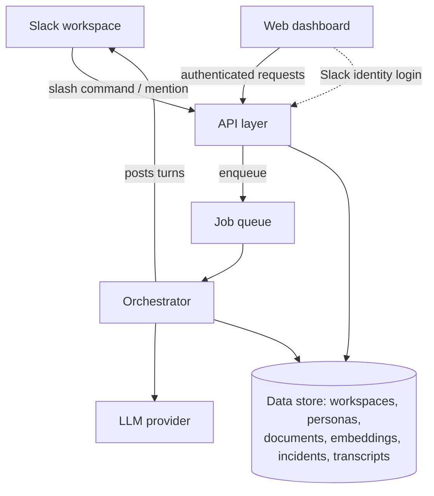
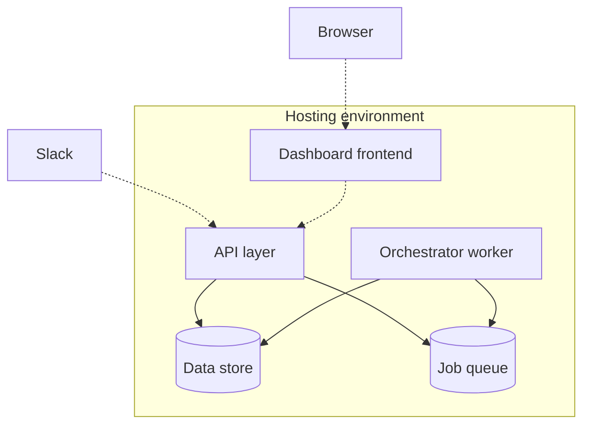

# AI War Room
## Business Requirements Document & Product Architecture

---

# PART A — Business Requirements Document (BRD)

## A.1 Executive Summary

AI War Room is a Slack-native tool that spins up a simulated team of specialist AI agents — network, database, application, and security — to debate an active incident in real time, in-thread, grounded in each team's own documentation. Instead of one AI producing a single flattened summary, the incident commander watches specialists agree, disagree, and converge, the way a real cross-functional team would — before a human specialist is even paged.

## A.2 Problem Statement

When an incident happens, the on-call commander must quickly form a hypothesis across domains they may not be expert in (network, database, application, security), usually while the people who *are* expert in those domains are asleep or unavailable. Existing AI incident tools compress this into one confident-sounding summary, which hides the uncertainty and disagreement that would actually help a commander know where to dig first.

## A.3 Business Objectives

| Objective | Description |
|---|---|
| Reduce mean time to hypothesis | Give the commander a plausible root-cause direction within minutes of starting the debate, not after paging multiple humans |
| Preserve institutional knowledge | Every debate is grounded in the team's own runbooks/docs, and every transcript becomes reusable knowledge |
| Low adoption friction | Lives inside Slack, where incidents already happen — no new tool for the commander to context-switch into during a fire |
| Sustainable monetization | Free/self-serve entry (small teams, limited personas/docs) with paid tiers for larger teams, unlimited history, and analytics |

## A.4 Target Users / Personas

| Persona | Role | Primary need |
|---|---|---|
| Incident Commander | On-call engineer running an active incident | Fast, trustworthy cross-domain signal without paging everyone immediately |
| Platform/SRE Admin | Configures the tool for their org | Easy way to keep each agent's knowledge base current |
| Paged Specialist | Joins mid-incident | Fast catch-up on what's already been ruled in/out |

## A.5 Scope

**In scope for MVP:**
- Multi-tenant data architecture from Day 1 (schema-level `workspace_id` scoping)
- Slack app installable via OAuth into workspaces with encrypted bot tokens
- Manual document upload per persona (Markdown/Plain text)
- Four fixed personas (network, database, application, security), each independently enable/disable-able and prompt-editable
- Slash-command-triggered debate using a **2-Stage Asynchronous Clash** (Stage 1: parallel specialist hypotheses; Stage 2: cross-domain rebuttal & consensus synthesis) posted threaded in Slack
- `@mention` follow-up to a specific agent after the initial debate
- Manual incident resolution command (`/criaisis resolve`)
- Lean Web dashboard: persona viewing, document management/upload, incident history, transcript viewer with cited chunk inspection

**Out of scope for MVP (see Part B, Section B.9 for roadmap):**
- Redis cluster (Go in-memory worker channels satisfy MVP queue needs via `JobQueue` interface)
- Aggregate analytics and vanity dashboards (deferred to focus on live incident signal)
- Live integrations with monitoring/alerting tools (Datadog, PagerDuty, GitHub)
- Automatic incident detection/triggering
- More than 4 personas or user-defined custom personas
- Multi-workspace paid billing/Stripe plan enforcement
- Mobile app

## A.6 Functional Requirements

| ID | Requirement |
|---|---|
| FR-1 | Admin can install the Slack app into their workspace via OAuth |
| FR-2 | Admin can upload, view, and delete documents, each tagged to exactly one persona |
| FR-3 | Admin can edit each persona's display name, system prompt, and enabled/disabled state |
| FR-4 | Any workspace member can start a debate via a Slack slash command with a free-text incident description |
| FR-5 | System runs a 2-Stage Asynchronous Clash: Stage 1 runs enabled personas concurrently in parallel; Stage 2 cross-examines hypotheses and synthesizes an IC consensus with cited runbook references |
| FR-6 | Each agent's response is grounded only in documents tagged to that agent's persona (no cross-persona knowledge leakage) |
| FR-7 | System posts a final synthesized summary highlighting contradictions and probable root cause in-thread |
| FR-8 | Any workspace member can `@mention` a specific agent after the debate to ask a follow-up question, and receive one additional grounded response |
| FR-9 | Any workspace member can mark an incident resolved via slash command |
| FR-10 | Dashboard users can browse past incidents, filter by status/date, and view a full transcript including which document excerpts each agent drew on for each turn |
| FR-11 | [Post-MVP] Dashboard shows aggregate analytics: incidents per week, average time-to-resolution, most-referenced documents |
| FR-12 | Dashboard access requires sign-in via the same Slack workspace identity (no separate password system) |

## A.7 Non-Functional Requirements

| Category | Requirement |
|---|---|
| Latency | Slash command must acknowledge within Slack's 3-second webhook window regardless of how long the debate itself takes |
| Data isolation | One workspace's documents, personas, and incident history must never be visible to another workspace |
| Availability | Debate posting should degrade gracefully (partial results posted) rather than fail silently if one agent's call errors |
| Auditability | Every agent turn must be traceable to the specific document excerpts that informed it |
| Privacy | Uploaded documents (runbooks, configs) are customer data — encrypted at rest, never used to train shared models across customers |

## A.8 Assumptions & Constraints

- Assumes the team already uses Slack as their incident-response channel of record.
- Assumes teams are willing to manually curate a modest starting document set (MVP does not auto-ingest from existing systems).
- Constraint: LLM API costs scale with debate rounds × personas × incident volume — pricing tiers must account for this.
- Constraint: solo/small engineering team building this — MVP scope is deliberately narrow to be buildable without a large team.

## A.9 Risks & Mitigations

| Risk | Mitigation |
|---|---|
| Agents produce plausible-sounding but wrong conclusions ("confident hallucination") | Every claim traceable to source excerpts in the transcript viewer; summary explicitly frames output as a hypothesis, not a verdict |
| Low document coverage makes agents unhelpful ("garbage in, garbage out") | Onboarding flow nudges admins to seed at least a minimal doc set per persona before first use; empty-persona state is visibly flagged, not silently guessed |
| Alert fatigue / noisy threads if debates run too long | Fixed, small round count by default; admin-configurable ceiling |
| Cost overrun on LLM spend at scale | Round/persona limits enforced server-side per plan tier |

## A.10 Success Metrics

- Incidents run through the tool per active workspace per week (adoption depth)
- Median time from debate start to resolution, trending down as document coverage grows
- 30-day workspace retention post-install
- % of debates where the IC follows up with `@mention` (proxy for perceived usefulness — people only dig deeper into tools they trust)

## A.11 Stakeholders

| Role | Responsibility |
|---|---|
| Product owner | Prioritization, roadmap, customer conversations |
| Backend engineer(s) | API, orchestrator, data model |
| Frontend engineer(s) | Dashboard |
| Design partner customers | Early validation, document seeding feedback |

---

# PART B — Product & System Architecture

## B.1 Architecture Overview

**Component responsibilities:**

| Component | Responsibility |
|---|---|
| API layer | Receives Slack webhooks and dashboard requests, handles auth, enqueues debate jobs — does no LLM work itself |
| Job queue | Go in-memory buffered worker pool (`chan IncidentJob`) satisfying a `JobQueue` interface; decoupled execution with zero extra infrastructure (Redis for horizontal scaling post-MVP) |
| Orchestrator | Runs the 2-Stage Asynchronous Clash: Stage 1 parallel specialist RAG + hypotheses; Stage 2 cross-rebuttal & consensus synthesis |
| Data store | PostgreSQL 16 + pgvector: multi-tenant system of record for workspaces, personas, documents, vector chunks, incidents, debate turns |
| LLM provider | Abstracted behind a single interface (`LLMClient`) so model vendor is swappable and test-mockable without touching debate logic |
| Web dashboard | Lean configuration (personas, runbook documents) and audit review (incident history, transcript viewer with cited chunks) |

## B.2 Data Model (Conceptual)

| Entity | Key attributes | Relationships |
|---|---|---|
| Workspace | Slack team ID/name, plan tier, install date | Has many users, personas, documents, incidents |
| User | Slack user ID, email, role (admin/member) | Belongs to a workspace |
| Persona | Key (network/db/app/security), display name, system prompt, enabled flag | Belongs to a workspace; has many documents |
| Document | Title, source type, raw text | Belongs to a workspace and a persona; has many chunks |
| Document Chunk | Chunk text, embedding vector | Belongs to a document, workspace, and persona — retrieval always filters by workspace + persona |
| Incident | Title, description, status, Slack channel/thread reference, timestamps | Belongs to a workspace; has many debate turns |
| Debate Turn | Round number, content, referenced chunk IDs, Slack message reference | Belongs to an incident and a persona |

**Tenant isolation principle:** every entity beneath Workspace carries a workspace reference, and every read/write is scoped to it — this is the single most important architectural invariant in the system, since a leak here means one customer's incident data appearing in another's dashboard.

## B.3 Feature-by-Feature Mini-Architecture

### B.3.1 Slack App Install & Workspace Auth
**Flow:** Admin clicks install → Slack OAuth redirect → API exchanges the temporary code for a permanent bot token → workspace record created/updated → admin lands on the dashboard, signed in.
**Key decision:** the bot token is the single most sensitive piece of data in the system (it grants posting/reading rights in the customer's Slack) — encrypted at rest, never logged, never returned to the frontend.

### B.3.2 Incident Trigger
**Flow:** Commander runs the slash command with a free-text description → API validates and immediately enqueues a job, replying with an acknowledgment message → returns within Slack's timeout window.
**Key decision:** this handler must do zero LLM or retrieval work — its only job is validate-and-enqueue, which is what makes the 3-second Slack deadline achievable regardless of how long the actual debate takes.

### B.3.3 Document Ingestion & Retrieval
**Flow (ingestion):** Admin uploads a document tagged to a persona → text is split into chunks → each chunk is embedded and stored, tagged with workspace and persona.
**Flow (retrieval):** Orchestrator takes the incident description, embeds it, and searches only chunks matching the requesting persona's workspace + persona tag → returns the top-matching excerpts.
**Key decision:** persona-scoped filtering is what keeps the network agent from ever seeing database-only documents — this is what makes the "specialist" framing real rather than cosmetic.

### B.3.4 Multi-Agent Debate Orchestrator (2-Stage Asynchronous Clash)
**Flow:**
- **Stage 1 (Parallel Blast, <10s):** Orchestrator fires concurrent goroutines (using `golang.org/x/sync/errgroup`) for each enabled persona. Each goroutine performs scoped vector retrieval against its persona's runbooks, calls the LLM with persona role + retrieved context + incident description, and writes the specialist hypothesis into a thread-safe collector.
- **Stage 2 (Cross-Rebuttal & Consensus Synthesis, <15s):** Orchestrator feeds the incident description and all Stage 1 specialist outputs into an adversarial synthesis prompt. The synthesis LLM call explicitly cross-examines the hypotheses (e.g., contrasting database lock claims with network packet drop evidence) and formulates the Incident Commander consensus hypothesis with cited runbook sections.
- **Posting & Persistence:** Each specialist turn and the final consensus are posted as threaded Slack Block Kit messages and permanently stored in `debate_turns`.
**Key decision:** Running Stage 1 concurrently reduces total turnaround time from ~90s to under 25s while preserving distinct domain viewpoints before synthesis.

### B.3.5 LLM Provider Layer
**Purpose:** a single abstraction point between the orchestrator and whichever model vendor is in use, so providers can be swapped, mixed per persona, or mocked entirely for testing — without touching debate logic.

### B.3.6 Slack Posting & Threading
**Flow:** Every turn is posted with a distinct sender identity per persona, always anchored to the original incident thread — never to the channel root — so the debate reads as a real, contained conversation rather than bot spam in the main channel.

### B.3.7 Follow-Up / @Mention Handling
**Flow:** Commander @mentions a specific agent with a question → API enqueues a single-agent job carrying the full existing history plus the new question → orchestrator runs one additional turn for just that persona → posts and persists it the same way as a normal round.

### B.3.8 Incident Resolution & Transcript Storage
**Flow:** Commander runs the resolve command → incident status and resolution timestamp update → the full ordered transcript becomes permanently queryable from the dashboard, forming the raw material for future analytics and knowledge reuse.

### B.3.9 Web Dashboard
| Page | Purpose |
|---|---|
| Login | Sign in with the workspace's Slack identity |
| Personas | View/edit each agent's prompt, enable or disable agents |
| Documents | Upload, tag, and remove knowledge per persona |
| Incident History | Browse, filter, and search past incidents |
| Transcript Viewer | Read a past debate turn-by-turn, with the source excerpts each turn drew on |
| Analytics | Team-level trends: incidents/week, time-to-resolution, most-cited documents |
| Settings | Team membership, plan, workspace-level configuration |

### B.3.10 Dashboard Authentication
**Flow:** User signs in with their Slack identity (not a separate password) → API verifies the identity token, resolves it to a workspace-scoped user record → issues a session tied to that workspace → all subsequent dashboard requests are automatically scoped to that workspace only.

## B.4 API Surface (Conceptual)

| Area | Operations |
|---|---|
| Slack webhooks | Receive slash commands; receive `@mention` events |
| Auth | Slack OAuth install callback; dashboard sign-in |
| Personas | List, view, create, edit |
| Documents | List, upload, delete |
| Incidents | List (paginated/filterable), view full transcript, mark resolved |
| Analytics | Retrieve aggregate summary metrics |

## B.5 Deployment Architecture

API and orchestrator worker run as independently scalable processes from the same codebase; the frontend is a separately deployed static build.

## B.6 Security & Multi-Tenancy

- Every data access scoped by workspace, enforced at the data-access layer, not just in request handlers — a bug in a handler should never be able to leak cross-tenant data.
- Slack bot tokens encrypted at rest.
- All inbound Slack webhook traffic cryptographically verified as genuinely originating from Slack before any processing occurs.
- Per-workspace rate limiting so one noisy tenant cannot degrade service for others.

## B.7 Scalability Considerations

- Orchestrator workers leverage Go's native lightweight goroutines and buffered channels for in-memory task decoupling during MVP, satisfying a clean `JobQueue` interface.
- For post-MVP multi-instance clustering, a Redis-backed queue implementation can be swapped into the `JobQueue` interface without altering orchestrator logic.
- Retrieval store with PostgreSQL `pgvector` HNSW indexing scales comfortably to millions of document chunks before specialized vector infrastructure is needed.
- 2-Stage Asynchronous Clash parallelizes domain persona queries via `errgroup`, bounding Stage 1 latency to the single slowest LLM call rather than the sum of 4 sequential calls.

## B.8 Tech Stack Summary

| Layer | Choice | Why |
|---|---|---|
| Backend | Go (Golang) | High concurrency, type safety, single static binary deployment, excellent fit for the async worker model |
| Data store | PostgreSQL 16 + pgvector | Unified ACID relational store and vector similarity search in a single database engine |
| Job queue | Go worker channels (with `JobQueue` interface) | In-process asynchronous decoupling without Redis operational overhead for MVP (Redis swappable post-MVP) |
| Frontend | React + TypeScript (Vite + Tailwind) | Clean, fast SPA for document management and incident transcript auditing |
| Hosting | Managed container platform (Fly.io / Render / AWS ECS) | Low operational maintenance, zero cluster management burden |

## B.9 Post-MVP Roadmap

- Redis-backed distributed queue for multi-instance horizontal scaling
- Aggregate analytics dashboard (incidents/week, average MTTR, most cited runbook documents)
- Live integrations (monitoring/alerting/deploy tools: Datadog, PagerDuty, GitHub) replacing manual runbook paste
- Automatic incident triggering from alerting tools instead of manual slash command
- Mining historical team chat for tribal knowledge to seed the document corpus automatically
- Auto-generated regression test/chaos experiment derived from each resolved incident
- Confidence scoring or structured voting among agents instead of fixed debate rounds
- Custom, user-defined personas beyond the default four